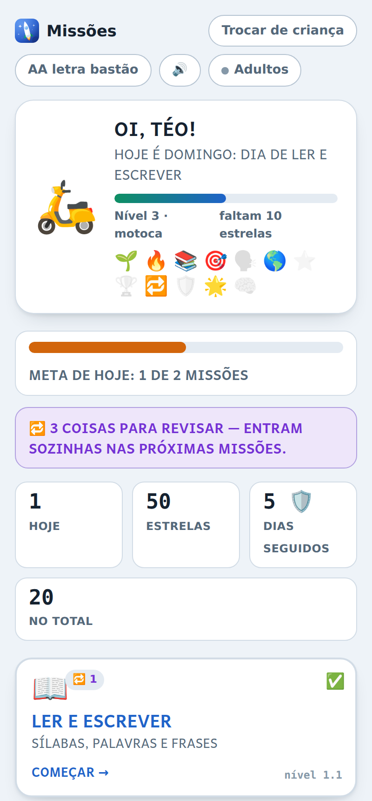
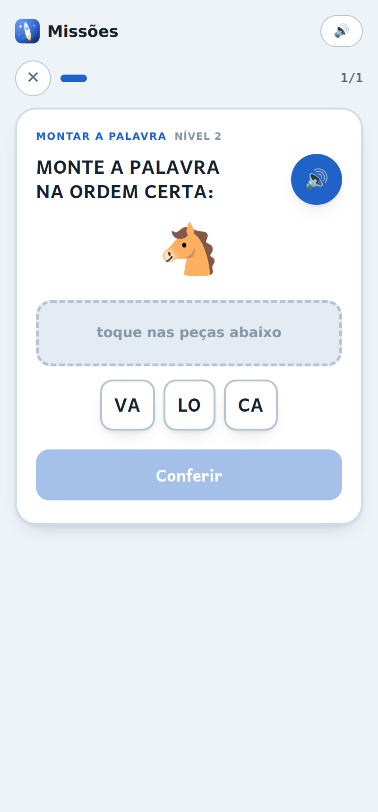
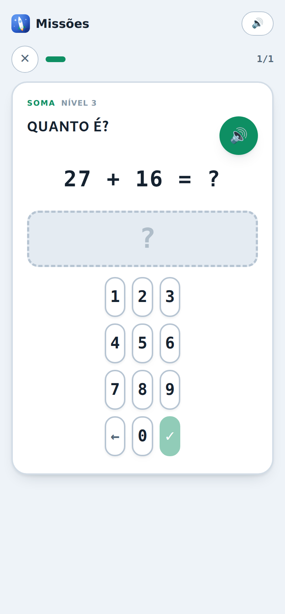
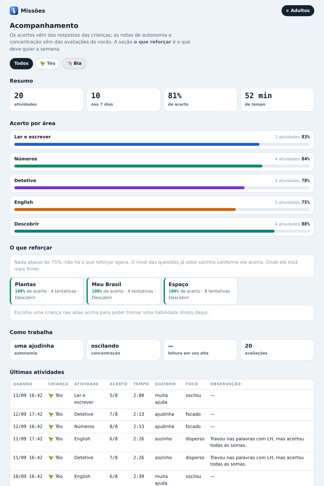

# Missões — app de estudos do 1º ano

App para crianças de 6 a 8 anos praticarem leitura, matemática, raciocínio, inglês e ciências.
A criança faz as atividades sozinha; o adulto avalia no fim e acompanha o desempenho num painel.

São 70 habilidades e mais de 100 mil perguntas diferentes, cada habilidade em 3 níveis que se
ajustam sozinhos ao ritmo da criança, com revisão espaçada do que ela errou e explicação em toda
resposta errada.

Funciona no computador e no celular, instala como aplicativo e roda offline. Não tem anúncio,
não tem compra, não manda dado nenhum para lugar nenhum — a não ser que você ligue a sincronização
no seu próprio banco.

| A tela da criança | Montar a palavra | Digitar a conta |
|---|---|---|
|  |  |  |

O acompanhamento dos adultos:



---

## 1. Publicar no GitHub Pages

O app é feito só de arquivos estáticos — não precisa de servidor.

### Se você usa o GitHub pelo terminal

```bash
cd missoes-app
git init
git add -A
git commit -m "Missoes: app de estudos do 1o ano"
gh repo create missoes --public --source=. --push
gh api -X POST repos/:owner/missoes/pages -f "source[branch]=main" -f "source[path]=/"
```

Em um ou dois minutos o app estará em `https://SEU-USUARIO.github.io/missoes/`.

### Se você prefere pelo site

1. Crie um repositório novo em [github.com/new](https://github.com/new), público, chamado `missoes`.
2. Na tela do repositório, clique em **uploading an existing file** e arraste **todo o conteúdo** desta pasta (inclusive as pastas `js`, `icones` e `fontes`).
3. Vá em **Settings → Pages**, em *Source* escolha **Deploy from a branch**, branch `main`, pasta `/ (root)`, e salve.
4. Aguarde o endereço aparecer no topo dessa mesma página.

> O arquivo `.nojekyll` já está incluído e é necessário: sem ele o GitHub ignora algumas pastas.

---

## 2. Instalar como aplicativo

Depois que o endereço estiver no ar, abra-o em cada aparelho.

- **Android (Chrome):** menu ⋮ → **Instalar aplicativo** (ou *Adicionar à tela inicial*).
- **iPhone / iPad (Safari):** botão de compartilhar → **Adicionar à Tela de Início**. No iPhone só funciona pelo Safari.
- **Windows / Mac (Chrome ou Edge):** ícone de instalar na barra de endereço, ou menu ⋮ → **Instalar Missões**.

Depois de instalado, ele abre em tela cheia, com o ícone do foguete, sem barra de navegador — e continua funcionando sem internet.

---

## 3. Ligar a sincronização entre aparelhos

Sem este passo o app já funciona: cada aparelho guarda o seu próprio histórico.
Ligue a sincronização para que **as crianças da família inteira — filhos, sobrinhos — apareçam
juntas**, em qualquer aparelho, e para que a seção *A turma* mostre os primos.

**Quem faz este capítulo é você, uma vez só.** Seus irmãos não precisam criar conta nenhuma no
Supabase, nem instalar nada: eles vão receber um link e pronto.

### 3.1 Criar o banco (você, uma vez)

1. Crie uma conta gratuita em [supabase.com](https://supabase.com) e clique em **New project**.
   Escolha a região *South America (São Paulo)* e guarde a senha do banco.
2. Com o projeto criado, abra **SQL Editor → New query**, cole o conteúdo inteiro do arquivo
   `schema.sql` desta pasta e clique em **Run**. Deve aparecer *Success*.
   Pode rodar de novo quando quiser: o arquivo é feito para isso.
3. Vá em **Project Settings → API** e copie os dois valores:
   - **Project URL** (algo como `https://abcdefgh.supabase.co`)
   - **anon public** (uma chave longa)

### 3.2 Apontar o app para o banco

Abra o arquivo `config.js` e preencha:

```js
window.CONFIG = {
  supabaseUrl: "https://abcdefgh.supabase.co",
  supabaseAnonKey: "cole-aqui-a-chave-anon"
};
```

Salve e publique de novo (`git add -A && git commit -m "config" && git push`).

Estes dois valores podem ficar públicos no GitHub. Quem controla o acesso são as regras
de segurança que o `schema.sql` criou: **cada família só enxerga os dados da própria família**,
mesmo estando todas no mesmo banco.

> **Deu errado?** Em **Adultos → Sincronizar** há um botão **Testar a conexão**. Ele diz em
> português o que está faltando — endereço torto, chave incompleta, tabelas não criadas ou
> projeto pausado.

### 3.3 Liberar o endereço do app no Supabase

Em **Authentication → URL Configuration**:

- **Site URL**: `https://SEU-USUARIO.github.io/missoes/`
- **Redirect URLs**: adicione a mesma URL.

Sem isso o link de acesso enviado por e-mail volta para o lugar errado.

### 3.4 Criar a família e convidar os irmãos

1. No app, entre em **Adultos** (PIN inicial `1234`) → **Sincronizar entre aparelhos**.
2. Digite seu e-mail e clique em **Receber link de acesso**. Abra o e-mail **no mesmo aparelho** e
   clique no link. Não tem senha: é sempre assim que se entra.
3. Clique em **Criar minha família** e dê um nome.
4. Vai aparecer um **link de convite**. Toque em **Copiar o link do convite** e mande no WhatsApp
   para seus irmãos.

**O que o seu irmão faz:** abre o link, entra em Adultos, digita o e-mail dele, clica no link que
chega por e-mail, e toca em **Entrar nesta família**. O código já vem preenchido pelo link — ele não
digita código nenhum.

Pronto: todos os aparelhos passam a ver as mesmas crianças e o mesmo histórico, e cada avaliação
fica registrada com o e-mail de quem avaliou.

> O plano gratuito do Supabase pausa projetos sem uso por uma semana. Se isso acontecer,
> basta entrar no painel e reativar — nenhum dado é perdido. Com a família usando o app, isso
> praticamente não acontece.

> **O áudio das leituras não é sincronizado.** Ele fica só no aparelho onde foi gravado. É voz de
> criança, e mandar isso para um servidor seria uma decisão de outra natureza.

## 4. Como funciona no dia a dia

**Para a criança**

1. Abre o app e toca no próprio avatar.
2. Escolhe uma missão. Cada uma tem 8 perguntas com botão de ouvir o enunciado.
3. Erra sem punição: a resposta certa acende, o app explica o porquê e ela segue.
4. No fim ganha estrelas, e o veículo evolui de patinete até nave espacial.

**Para o adulto**

1. Ao terminar, a criança clica em **Chamar o adulto**.
2. Você marca três coisas: se fez sozinho, como ficou a concentração e uma observação livre.
3. Se não estiver por perto, a atividade fica na fila de *esperando avaliação*.
4. Nas leituras em voz alta você ouve a gravação ali mesmo, antes de dar a nota de fluência.
5. Em **Está melhorando?** vê o acerto semana a semana, com quantas atividades teve em cada uma.
6. Em **Adultos** você acompanha acerto por área, **o que reforçar**, a fila de revisão e o **relatório da semana**.

**Dificuldade que se ajusta sozinha**

Cada uma das 70 habilidades — sílaba inicial, subtração, memória, cores em inglês, espaço, Brasil
e assim por diante — tem três níveis. Acima de 85% de acerto nas últimas tentativas o nível sobe;
abaixo de 50% ele desce. Isso acontece por habilidade, não por matéria: dá para estar no nível 3 de
soma e no 1 de subtração.

**Revisão espaçada: o erro volta até virar aprendizado**

Errar uma vez e nunca mais ver aquilo não ensina. Por isso o app usa o mesmo princípio do Anki e das
caixinhas de Leitner: quando a criança erra uma habilidade, ela entra numa fila e reaparece já na
próxima missão daquela matéria, marcada com 🔁. A cada acerto o intervalo aumenta — 1 dia, 3 dias,
7 dias, 16 dias — e depois de acertar várias vezes seguidas ela sai da fila.

Cada missão traz no máximo 3 perguntas de revisão, para não virar só correção de erro. A tela inicial
mostra quantas coisas estão na fila, e o painel dos adultos também.

**Quatro jeitos de responder, não só múltipla escolha**

Com 3 alternativas a criança acerta 1 em 3 chutando, sem ler. Por isso o app tem outros formatos:

| Formato | Onde aparece |
|---|---|
| **Escolher** entre alternativas | a maioria das habilidades |
| **Digitar** a resposta num tecladinho | Soma, Subtração, Tabuada e Quanto falta, no nível 3 |
| **Montar** tocando nas peças em ordem | Montar a palavra, Montar a frase, Colocar em ordem |
| **Ligar** os pares | Ligar os pares, Ligar em inglês, Ligar as contas |
| **Escrever** no teclado do alfabeto | Escrever a palavra, Ditado, Completar a palavra |

Repare no pulo: no nível 3 de Soma ela não escolhe mais entre três números, ela **calcula e digita**.
É outra tarefa mental — e é exatamente a diferença entre reconhecer e saber.

**Escrever** é o mesmo salto na alfabetização. Escolher "casa" entre três opções e escrever
C-A-S-A são habilidades diferentes, e a segunda é metade do que se aprende no 1º ano:

- **Escrever a palavra** — vê a figura e escreve o nome dela.
- **Ditado** — o app fala a palavra, ela escreve. Aqui o botão de ouvir existe sempre: a palavra
  falada é o enunciado, não um atalho.
- **Completar a palavra** — vê `F O _ U E T E` e escreve a letra que falta.

O teclado traz o alfabeto **em ordem alfabética**, não em QWERTY: com 6 anos ela conhece a ordem do
ABC, não a do teclado do computador. Há uma casinha para cada letra, então ela vê de quantas
precisa, e o app só usa palavras sem acento — acento quase não se vê no 1º ano.

**Treinar uma habilidade específica**

Saber o que está travando só ajuda se der para agir. Em **Adultos**, na seção *o que reforçar*,
cada habilidade fraca tem um botão **Treinar isso ▸**. Ele abre na hora uma missão de 8 perguntas
só daquela habilidade, no nível atual da criança. Vale como atividade normal e aparece no histórico
marcada como treino.

**Leitura em voz alta: a criança grava, o adulto ouve depois**

Esta atividade **não tem botão de ouvir o texto**. Se o app lesse primeiro, a criança repetiria de cor
em vez de decifrar — que é justamente o que se quer treinar.

No lugar disso há um microfone. A criança toca, lê o texto, toca de novo para parar, e pode **se
ouvir antes de entregar** — perceber sozinha que travou numa palavra ensina mais do que alguém
dizer que ela travou. Se não gostar, grava de novo.

Depois, quando você for avaliar, a gravação aparece ali na tela junto com o texto: dá para ouvir com
calma, acompanhando as palavras, antes de marcar como foi a leitura. Comparando as gravações de
semanas diferentes dá para ouvir o progresso.

> **Onde o áudio fica:** só neste aparelho, na memória do navegador. Ele **não** vai para a
> sincronização, **não** entra no arquivo de histórico e **não** é enviado para lugar nenhum. É voz
> de criança. O app guarda as últimas 12 gravações de cada criança e apaga as antigas sozinho;
> em Adultos → Ajustes dá para ver quanto espaço ocupam e apagar todas.
>
> Se o aparelho não tiver microfone, ou se o navegador não liberar, a atividade continua funcionando
> do jeito antigo: a criança lê em voz alta ao vivo e você escuta.

**O botão de ouvir a pergunta**

Nas outras matérias existe um 🔊 que lê o enunciado. É útil para quem ainda não lê bem — e é também
uma muleta: com ele à mão, muita criança toca para escutar em vez de ler.

Por isso ele agora vem **ligado só em inglês**, onde ouvir a pronúncia é o próprio conteúdo da
matéria. Em Adultos → Ajustes dá para mudar para *em todas as perguntas* ou *em nenhuma*.

A explicação que aparece depois de um erro continua podendo ser ouvida em qualquer modo: ali a
criança já errou e precisa de ajuda, não de um atalho.

**Explicação quando erra**

Toda pergunta tem um "por quê". Quando a criança erra, além de acender a resposta certa o app mostra
e lê a explicação — `9 − 7 = 2`, `BORBOLETA se separa assim: bor - bo - le - ta` — antes de liberar
o botão de continuar.

**Está melhorando?**

A pergunta que todo pai faz, e que o painel não respondia. Agora há um gráfico com uma coluna por
semana, mostrando o acerto de cada uma, e uma frase resumindo: *"Subiu 34 pontos — de 54% em 26/07
para 88% em 13/09."*

Embaixo de cada semana vai escrito quantas atividades ela fez. Isso é de propósito: uma semana de
100% com uma atividade só não é um triunfo, e o gráfico não pode deixar você achar que é. Semana em
branco aparece vazia, nunca como zero — não fazer nada é diferente de errar tudo.

**A turma: irmãos e primos juntos**

Quando há mais de uma criança cadastrada, aparece na tela inicial uma seção **A turma**, com o
veículo e a sequência de cada uma, e um placar do grupo: *"Juntos, a turma já fez 12 missões esta
semana!"*.

De propósito **não existe classificação**: ninguém é primeiro nem último, e a ordem é alfabética.
Com 6 anos um ranking motiva quem já vai bem e desanima justamente quem mais precisa. O que sobe
quando alguém estuda é o placar do grupo — todo mundo ganha junto.

Para os primos aparecerem aí, eles precisam estar na mesma família, o que exige a sincronização
ligada (seção 3). No mesmo aparelho, irmãos já aparecem sem configurar nada.

**Meta do dia e escudo**

Cada criança tem uma meta de missões por dia (padrão: 2, dá para mudar em Adultos → Crianças).
A cada 5 dias seguidos ela ganha um escudo 🛡️; se um dia ficar em branco, o escudo cobre aquele dia
e a sequência não quebra. Guarda no máximo 2. A ideia é a mesma do *streak freeze* do Duolingo:
perder a sequência por causa de um imprevisto desanima mais do que ensina.

**Sons e música**

O app faz os próprios sons e a própria música: **não existe nenhum arquivo de áudio**, é tudo gerado
pelo navegador na hora. Por isso continua leve, funciona offline e não tem nenhuma questão de licença
para publicar. O celular também vibra nos acertos e erros.

A música de fundo é feita para acompanhar sem atrapalhar:

- toca sempre em escala pentatônica, onde nenhuma combinação de notas soa errada;
- é lenta, baixinha e cheia de pausas, sem melodia marcante — para a criança não ficar cantarolando
  em vez de pensar;
- as notas são sorteadas em caminhada, nunca se repetindo igual: não é um loop de poucos segundos;
- **abaixa sozinha quando o app fala**, para o enunciado sair limpo;
- **para por completo na leitura em voz alta**, quando a criança lê e o adulto escuta;
- para quando o app vai para segundo plano, para não ficar tocando no bolso.

O botão 🔊 no topo desliga tudo de uma vez — música, efeitos e voz. Em **Adultos → Ajustes** dá para
desligar só a música e manter os efeitos.

> Se a criança se distrai com facilidade, vale desligar a música por uma semana e comparar a nota de
> concentração no relatório. É justamente para isso que o relatório existe.

---

## 5. Ajustes que você provavelmente vai querer fazer

| O quê | Onde |
|---|---|
| Trocar o PIN dos adultos | dentro do app, em Adultos → Ajustes |
| Mudar entre LETRA BASTÃO e letra escolar | botão no topo, por criança |
| Adicionar ou remover crianças | Adultos → Crianças |
| Treinar uma habilidade específica | Adultos → o que reforçar → **Treinar isso** |
| Mudar a meta de missões por dia | dentro do app, em Adultos → Crianças |
| Ligar e desligar os sons e a música | botão 🔊 no topo |
| Mudar o botão de ouvir a pergunta | Adultos → Ajustes |
| Ver espaço das gravações e apagá-las | Adultos → Ajustes |
| Desligar só a música de fundo | Adultos → Ajustes |
| Acrescentar palavras, contas ou perguntas | `js/questoes.js` |
| Mudar cores e tamanhos | `estilo.css` |
| Mudar quantas perguntas tem cada missão | `js/app.js`, constante `NQ` |
| Mudar quantas revisões cabem numa missão | `js/app.js`, constante `MAX_REVISAO` |
| Mudar os intervalos da revisão espaçada | `js/app.js`, constante `ESPERA` |
| Mudar quantas estrelas sobem de nível | `js/app.js`, constante `POR_NIVEL` |
| Mudar os sons | `js/som.js` |
| Mudar a música (andamento, escala, volume) | `js/musica.js` |
| Mudar quantas gravações ficam guardadas | `js/gravador.js`, `GUARDAR_POR_CRIANCA` |

**Esqueceu o PIN dos adultos?** Ele fica guardado no próprio navegador. Abra o app, pressione F12
(ou, no celular, abra num computador), vá em *Application → Local Storage*, procure a chave
`missoes.dados.v2` e leia o campo `cfg.pin`. Se preferir começar do zero, apagar essa chave zera o
app inteiro — inclusive o histórico, então salve o arquivo antes.

Depois de qualquer alteração, aumente o número em `var CACHE = "missoes-v2"` no arquivo `sw.js`
(por exemplo para `missoes-v3`) e publique. Isso força os aparelhos já instalados a pegarem a versão nova.

---

## 6. Arquivos

```
index.html                 telas do app
estilo.css                 aparência, tema claro e escuro
config.js                  onde vão as chaves do banco (opcional)
manifest.webmanifest       faz o navegador tratar como aplicativo
sw.js                      cache offline
schema.sql                 banco de dados, para colar no Supabase
js/questoes.js             o banco de questões, por habilidade e nível
js/app.js                  telas, perfis, níveis, revisão, recompensas, painel
js/som.js                  efeitos sonoros, gerados pelo navegador
js/musica.js               música de fundo, também gerada na hora
js/gravador.js             grava a leitura em voz alta e guarda no aparelho
js/sync.js                 sincronização entre aparelhos
testes/testar.js           confere o banco de questões inteiro
testes/interface.js        joga o app num navegador de verdade
capturas/                  imagens usadas aqui e na tela de instalação
icones/                    ícones do app
fontes/                    fonte escolar Andika (SIL Open Font License)
```

Sem sincronização, tudo fica no navegador do aparelho. Em Adultos → Ajustes há
**Salvar histórico em arquivo** e **Abrir arquivo de histórico** para levar os dados na mão.
As gravações de áudio ficam de fora desse arquivo de propósito: são pesadas e são voz de criança.

## 7. Mexer no banco de questões sem quebrar nada

O arquivo `js/questoes.js` tem 70 habilidades. Cada uma é uma função que recebe o nível (1, 2 ou 3)
e devolve uma questão. Depois de mexer nele, rode:

```bash
node testes/testar.js
```

O teste sorteia 2.000 questões de cada habilidade em cada nível e confere que todas têm enunciado,
resposta possível no formato certo, nenhuma alternativa repetida ou vazia, explicação de erro, e
variedade suficiente para a criança não decorar.

Existe um segundo teste, que abre o app num navegador de verdade e **joga**: digita no tecladinho,
monta palavras, liga pares, faz uma missão inteira e entra na área dos adultos. São 32 verificações.

```bash
npm install --no-save playwright
npx playwright install chromium
node testes/interface.js
```

Os dois rodam sozinhos a cada `push`, pelo GitHub Actions. Se algo quebrar, aparece um ✗ vermelho
no GitHub antes de chegar na criança. **Você não precisa rodar nada disso à mão** — é a rede de
proteção para quando alguém (você, eu, ou outra pessoa) mexer no código.

> Se acrescentar uma habilidade nova, o `tag` dela precisa ser único — é a chave do histórico de
> nível de cada criança. O teste reclama se houver repetição.


---

## De onde vieram as ideias

Este app é caseiro, mas as mecânicas não foram inventadas do zero:

- **Revisão espaçada** — caixas de [Leitner](https://pt.wikipedia.org/wiki/Sistema_Leitner) e o
  agendador [FSRS](https://github.com/open-spaced-repetition/free-spaced-repetition-scheduler)
  usado no Anki. Aqui numa versão bem simplificada, adequada a criança de 6 anos.
- **Níveis por habilidade e progressão suave** — o [GCompris](https://github.com/gcompris/GCompris-qt),
  suíte educativa livre do KDE, com mais de 180 atividades para crianças de 2 a 10 anos.
- **Meta diária, sequência e escudo** — o modelo de hábito do Duolingo (*daily goal* e *streak freeze*).
- **Domínio por habilidade, não por matéria** — o jeito da Khan Academy de mostrar progresso.

## Créditos

Fonte [Andika](https://software.sil.org/andika/), da SIL International, distribuída sob a
SIL Open Font License 1.1 — desenhada para alfabetização, com o `a` e o `g` de uma perna só,
iguais aos do caderno.
